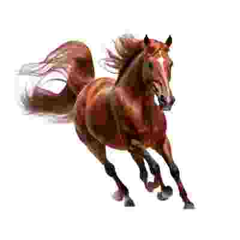

 You can tell its the logo because its a horse and horses say neigh.

# Neighbine

A quite bad web based game engine using pixi.js and howler.js

## Features:

- ECS
- Scene System
- Audio and Graphics handling

## To Use:

Install: `pnpm i`\
Start dev server: `pnpm dev:watch`\
Launch dev server in Neutralino: `pnpm start`\
Build to EXE: `pnpm build`\
Build to Web: `pnpm build:web`
